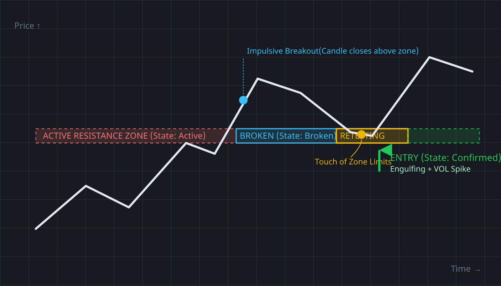
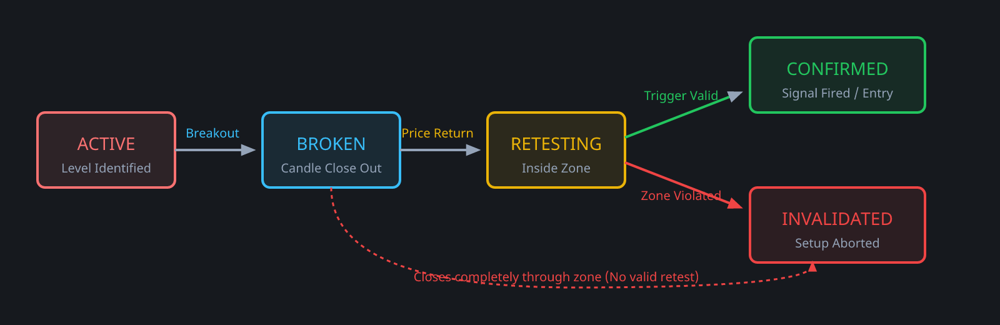

# Documentation: Break-Retest Pro Trading Indicator (NinjaTrader 8)

## 1. Introduction & Core Strategy Concept

The **Break-Retest Strategy** is one of the pillars of structural technical analysis used extensively by both systematic retail algorithms and institutional desks. It relies on the principle of market memory: once a major structural support or resistance level is broken with decisive volume, the supply/demand equilibrium shifts, reversing the level's functional role. A former ceiling (resistance) becomes a new floor (support), and vice-versa.

Traditional technical indicators often fail to capture this pattern because they evaluate price lines strictly as zero-width points. This indicator mitigates failure points by adapting two essential paradigms:
1. **Dynamic Price Zones:** Financial instruments rarely pivot down to the exact tick. Institutional participants cluster orders inside price ranges, often creating liquidity sweeps (stop hunts) slightly beyond precise levels. This indicator encapsulates levels inside mathematically calculated buffers.
2. **Deterministic State-Machine Control:** Rather than relying on a loose matrix of unstructured variables or global boolean flags (`isBroken`, `hadRetest`), each identified zone runs an autonomous structural life cycle. This minimizes memory leaks, optimizes performance, and isolates trading signals cleanly from market noise.

---

## 2. Technical Schematic & Visualizing the Setup

Below is a technical layout illustrating how a resistance zone shifts through states from initial definition to execution.



---

## 3. The State-Machine Lifecycle

Every single zone tracked in the repository operates within a strict algorithmic lifecycle. The programmatic flow transitions sequentially as follows:



1. **`Active`:** The level has been validated by price action (e.g., a structural swing point). Price remains bounded on the native side of the level.
2. **`Broken`:** An asset bar achieves a confirmed close completely penetrating the outer boundaries of the zone. This confirms structural breakout momentum.
3. **`Retesting`:** Price mean-reverts back into the breakout zone's boundaries. The system marks this zone as a high-priority "Point of Interest" (POI) and watches for buyer/seller absorption.
4. **`Confirmed`:** A specified entry trigger is met inside or immediately exiting the zone parameters. A trade execution signal is dispatched, and drawing markers pin onto the user interface.
5. **`Invalidated`:** The counter-trend momentum violates the level (e.g., price collapses fully back below a broken resistance zone and closes on the wrong side). The state engine drops tracking to protect capital.

---

## 4. Structural Level Generation Engines

To capture institutional interest efficiently, the indicator combines macro session milestones with microscopic price action structures:

### A. High-Timeframe Context: Prior Day Levels (OHLC)
Commercial market makers execute major orders around prior day boundaries due to resting order book liquidity. When enabled, the indicator references the market's initial session bars to calculate:
* **Previous Day High (PDH):** Represents the ultimate supply ceiling of the previous day. Breaking it signals macro bullish expansion.
* **Previous Day Low (PDL):** Represents the ultimate demand floor of the previous day. Breaking it signals macro liquidation expansion.

*Note: HTF session zones are drawn with highly saturated, prominent fills (**Dark Red** and **Dark Green**) to immediately communicate macro importance.*

### B. Micro-Structure: Fractal Swing Highs & Lows (Pivots)
For intra-day execution, the engine runs a localized scanning routine using an **N-Bar Extremum Rule**:
* A **Swing High** is locked if a bar high is higher than the highs of *N* bars prior and *N* bars subsequent.
* A **Swing Low** is locked if a bar low is lower than the lows of *N* bars prior and *N* bars subsequent.

*The N variable is configured via the user property `Swing Strength`.*

---

## 5. Visual Dashboard & UI Color Legend

The geometric properties plotted by the indicator dynamically update opacity, boundaries, and colors based on real-time structural shifts:

### Tracking Zones (Rectangles)
* **🟢 Light Green (`LightGreen`):** Micro structural support zone tracked from a local fractal Swing Low.
* **🔴 Light Red (`LightCoral`):** Micro structural resistance zone tracked from a local fractal Swing High.
* **🟩 Dark Green (`SeaGreen`):** High-timeframe macro support zone derived from the **Previous Day Low (PDL)**.
* **🟥 Dark Red (`OrangeRed`):** High-timeframe macro resistance zone derived from the **Previous Day High (PDH)**.
* **🟦 Light Blue (`LightSkyBlue` with dark blue border):** Level has been successfully penetrated (`Broken` State). Currently waiting for price to correct back into the zone.
* **🟨 Yellow (`Yellow` with golden border):** **Critical Alert Mode**. Price is currently inside the zone limits (`Retesting` State). The algorithm is actively scanning for trigger conditions.

### UI Execution Signals
* **⬆️ Lime Green Arrow (`Lime`):** A buy signal confirmed by structural absorption and your selected trigger engine.
* **⬇️ Solid Red Arrow (`Red`):** A sell signal confirmed by structural absorption and your selected trigger engine.
* **📝 Text Marker "VOL":** Appends to the arrow if the entry was verified using the advanced Institutional Volume Filter.

---

## 6. Advanced Entry Engines & The Institutional Volume Filter

Once a tracking zone transitions to the `Retesting` state, execution is delegated to the user's chosen confirmation engine:

```
[Simple Price Action]  --> Executes immediately on a single color-conforming close.
[Engulfing Pattern]   --> Executes on a 2-bar structural momentum reversal.
[Volume-Backed Eng.]  --> Evaluates the 2-bar reversal against an institutional volume matrix.
```

The flagship engine **`VolumeBackedEngulfing`** filters retail noise by applying an algorithmic threshold. When an engulfing pattern completes, the system queries the previous 20 bars to compute an exact volume moving average ($V_{avg}$). The entry is authorized **only if** the breakout reversal bar ($V_{0}$) contains substantial institutional presence:

$$V_{0} > V_{avg} * 1.2$$

This prevents taking entries during low-liquidity periods (e.g., market lunch hours, bank holidays) where price can drift aimlessly through key levels. A **20%+ spike** confirms that capitalization is actively defending the structural transition.

---

## 7. Parameters Configuration Guide

| UI Parameter Name | Data Type | Default | Operational Description |
| :--- | :--- | :--- | :--- |
| **`Swing Strength`** | Integer | `5` | Specifies the window size for local fractal pivots. A value of 5 requires 5 bars to the left and 5 bars to the right to be lower/higher. Increase for cleaner major swings. |
| **`Zone Tolerance (Ticks)`** | Integer | `4` | Controls the vertical radius of the zone from the exact peak/trough price tick. For high-volatility indices (e.g., Nasdaq Future / NQ), scale this up (e.g., 8–14 Ticks). |
| **`Use Prior Day Levels`** | Boolean | `true` | Toggles the automatic extraction, mapping, and state-tracking of Previous Day High/Low boundaries. |
| **`Trigger Logic`** | Enum | `VolumeBackedEngulfing` | Programmatic selection of the entry validation layer: `SimplePriceAction`, `Engulfing`, or `VolumeBackedEngulfing`. |

---

## 8. Installation & Compilation Instructions (NinjaTrader 8)

To seamlessly deploy the production script into your local environment:

1. Launch **NinjaTrader 8**.
2. Navigate to the top control center menu: **New** -> **NinjaScript Editor**.
3. In the right-hand side panel (*NinjaScript Explorer*), right-click on the **Indicators** category folder and select **New Indicator...**
4. Set the name to exactly: **`BreakRetest`** *(Note: exact casing is mandatory to preserve class definition bindings)*. Click *Next*, then *Finish*.
5. Inside the code workspace, select all code text by pressing **`Ctrl + A`** and delete it entirely via **`Delete`**. The file workspace must be 100% blank.
6. Copy the compiled final C# source code provided in the conversation thread.
7. Paste it cleanly into the empty script file workspace (**`Ctrl + V`**).
8. Press **`F5`** on your keyboard (or click the green **Compile** button in the top menu layout).
9. Watch for the gray loading status bar at the bottom. Once you hear the audible confirmation chime, compilation has succeeded.
10. Open a live chart (e.g., E-mini S&P 500 / ES), right-click the workspace, select **Indicators**, choose **`BreakRetest`**, and click **OK**.

---

## 9. Risk Mitigation & Strategy Guidelines

### A. Precision Protective Stop-Loss (SL) Placement
* **Long Positions:** Place the protective SL 1 to 2 ticks below the absolute lowest wick achieved exclusively during the `Retesting` state sequence. This honors structural validation. If price violates this low, the pattern is structurally broken.
* **Short Positions:** Place the protective SL 1 to 2 ticks above the absolute highest wick achieved exclusively during the `Retesting` state sequence.

### B. Mathematical Risk-to-Reward Ratios (RRR)
Because the state engine tracks price reversion into the zone, entries are triggered close to the structural invalidation point. Ensure you target a minimum **RRR of 1:2**. The distance to your target (the original breakout swing extreme) should be at least double your structural stop distance.

### C. Market Regime Filtering
While the system operates bidirectionally, strategy win rates improve dramatically when trading inline with macro trends. If a higher timeframe (e.g., 1-Hour or 4-Hour chart) shows an established uptrend, ignore short entry alerts entirely and execute **only** on green long breakout-retest triggers.
